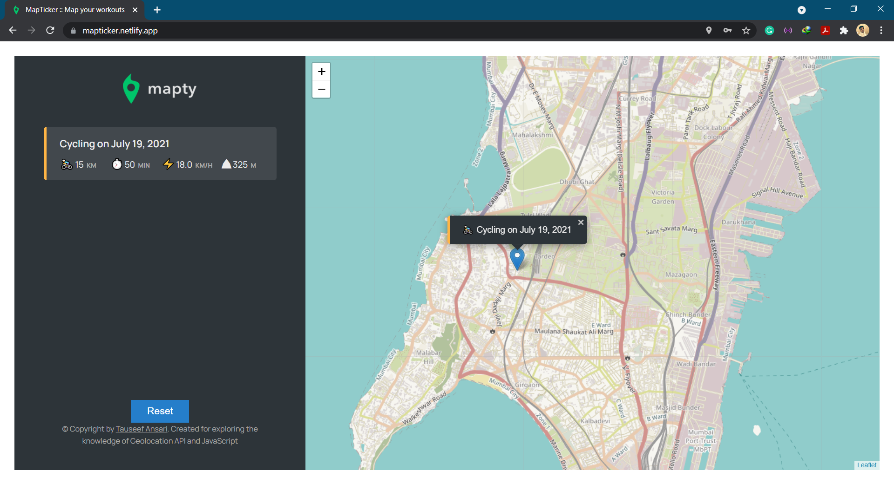
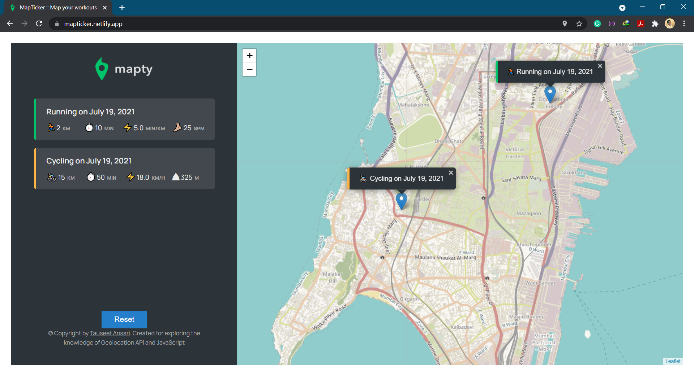

## Mapticker-Map-Locations
> A Javascript based map with geolocation to keep track of Running and Cycling of a users activity

## Actually want to use?
[Map-Ticker](https://mapticker.netlify.app/) is simple Javascript based map with geolocation to keep track of Running and Cycling of a users activity

## Snapshots

